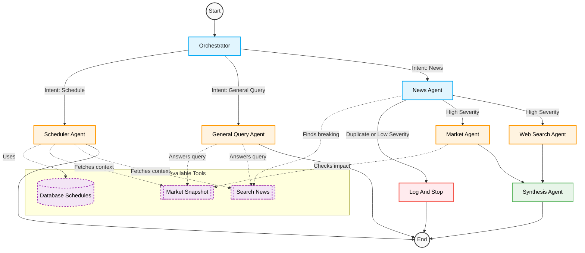

# GeoSignal

GeoSignal is an agentic framework designed to process user requests, monitor breaking geopolitcal/financial news, and answer general queries.

## Agent Architecture & Workflow

Below is the execution graph and agent orchestration flow for GeoSignal:

### Agents Description:

- **Orchestrator**: The entry point. Extracts user intent (`schedule`, `general_query`, or `news`) and routes the request.
- **News Agent**: Fetches and analyzes current breaking events. Checks for duplicates and evaluates the event severity.
- **Scheduler Agent**: Manages and configures CRON job alerts for users based on their requests.
- **General Query Agent**: Uses standard tools (like web search / market snapshots) to quickly answer direct questions.
- **Market Agent**: Looks into the financial market snapshot to measure the impact of breaking events.
- **Web Search Agent**: Identifies matching historical precedents and recovery timelines for market events.
- **Synthesis Agent**: Combines outputs from the News, Market, and Web Search agents into a cohesive Telegram alert and logs the event.

## Deployment on Render

To deploy GeoSignal on Render as a **Web Service**:

- **Build Command**: `pip install -r requirements.txt`
- **Start Command**: `python -m uvicorn main:app --host 0.0.0.0 --port $PORT`
- **Environment Variables**:
  - `OPENAI_API_KEY`: Your OpenAI key.
  - `TELEGRAM_BOT_TOKEN`: Your Telegram bot token.
  - `TAVILY_API_KEY`: Your Tavily API key.
  - `MONGO_URI`: Your MongoDB connection string (e.g., MongoDB Atlas).
